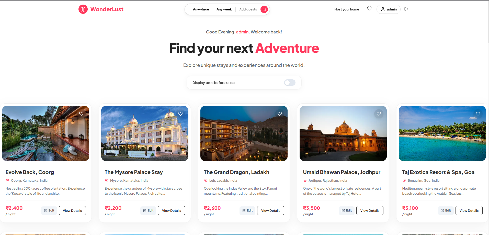
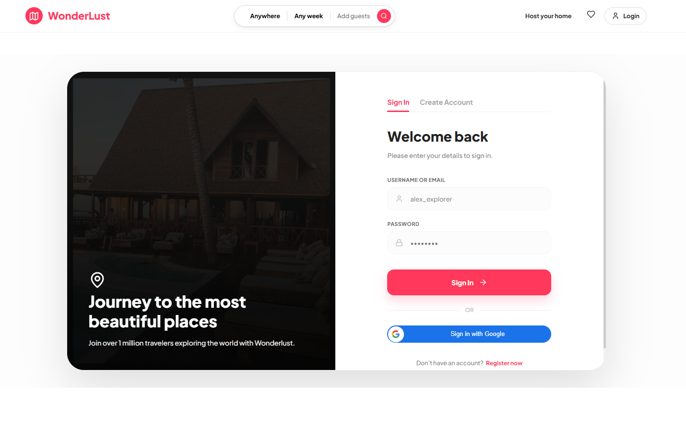
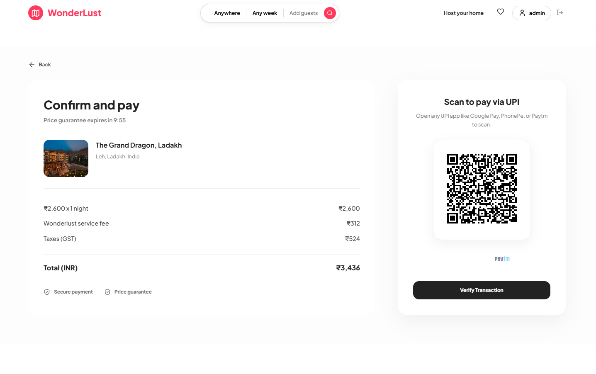

# 🌍 WonderLust - Premium Travel & Accommodation Platform


**WonderLust** is a modern, high-end travel booking platform designed to connect travelers with unique stays and experiences. Built with the **MERN Stack**, it features a stunning **Glassmorphism UI**, **Dynamic UPI Payments**, and **Interactive Maps**.

---

## ✨ Key Features

### 🚀 **User Experience**
- **Premium Glassmorphism Design**: A visually striking interface with blur effects, smooth gradients, and elegant typography.
- **Fluid Animations**: Powered by **Framer Motion** for seamless page transitions and interaction feedback.
- **Responsive Layout**: Fully optimized for Desktop, Tablet, and Mobile devices.

### 💳 **Dynamic UPI QR Payments**
- **Instant Payment Generation**: Generates a unique UPI QR code for every booking.
- **Smart Amount Embedding**: The QR code automatically includes the exact booking amount and transaction notes.
- **Universal Compatibility**: Scannable by any UPI app (Google Pay, PhonePe, Paytm, etc.).

### 🗺️ **Interactive Maps**
- **Live Location Mapping**: Integrated **Leaflet Maps** to show exact property locations.
- **Geocoding**: Automatic coordinate conversion from addresses using OpenStreetMap.

### 🔐 **Advanced Security**
- **Secure Authentication**: Traditional Email/Password login + **Google OAuth** integration.
- **Role-Based Access**: Specialized features for **Admins**, **Hosts**, and **Guests**.
- **Data Protection**: Encrypted user data and secure session management.

---

## 📸 Screenshots

### 1. **Home Page**
*Explore unique destinations with our immersive grid layout.*



<br><br>

### 2. **Login & Authentication**
*Beautiful, secure login screen with animated backgrounds.*



<br><br>

### 3. **Checkout & Payment**
*Seamless checkout with Dynamic UPI QR Code generation.*




---

## 🛠️ Technology Stack

### **Frontend**
- **Framework**: React.js (Vite)
- **Styling**: Modern CSS3, Glassmorphism, Responsive Design
- **Animations**: Framer Motion
- **Maps**: React-Leaflet / OpenStreetMap
- **Icons**: Lucide React
- **HTTP Client**: Axios

### **Backend**
- **Runtime**: Node.js
- **Framework**: Express.js
- **Database**: MongoDB (Atlas)
- **Authentication**: Passport.js, Google OAuth 2.0
- **Image Storage**: Cloudinary / Unsplash Source

---

## 🚀 Getting Started

### Prerequisites
- **Node.js**: v18+ installed
- **MongoDB**: Local URI or Atlas Connection String

### 1. Clonse the Repository
```bash
git clone https://github.com/Amit-akm-22/WonderLust.git
cd WonderLust
```

### 2. Backend Setup
```bash
cd backend
npm install
```
**Create a `.env` file in the `backend` directory:**
```env
PORT=8080
mongoDB=your_mongodb_connection_string
SECRET=your_session_secret
GOOGLE_CLIENT_ID=your_google_client_id
FRONTEND_URL=http://localhost:5173
```
**Start the Server:**
```bash
npm start
```

### 3. Frontend Setup
```bash
cd frontend
npm install
```
**Create a `.env` file in the `frontend` directory:**
```env
VITE_API_URL=http://localhost:8080
VITE_GOOGLE_CLIENT_ID=your_google_client_id
```
**Start the React App:**
```bash
npm run dev
```

---

## ☁️ Deployment

### **Frontend (Vercel)**
The frontend is optimized for deployment on **Vercel**.
1. Import the `frontend` folder to Vercel.
2. Set Framework Preset to **Vite**.
3. Add Environment Variable: `VITE_API_URL` -> (Your Backend URL).

### **Backend (Render)**
The backend is ready for **Render**.
1. Create a new Web Service using the `backend` folder.
2. Build Command: `npm install`
3. Start Command: `npm start`
4. Add Environment Variables: `mongoDB`, `SECRET`, `GOOGLE_CLIENT_ID`, `FRONTEND_URL`.

---

## 🤝 Contributing
Contributions are welcome! Please fork the repository and create a pull request.

## 📄 License
This project is licensed under the MIT License.

---
Made with ❤️ by **Amit**
